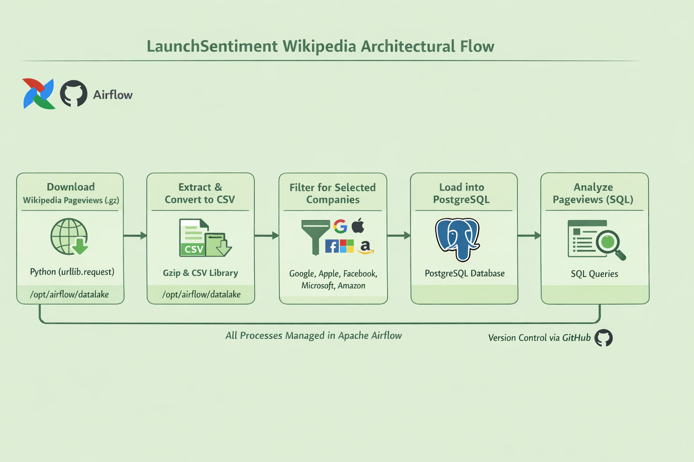
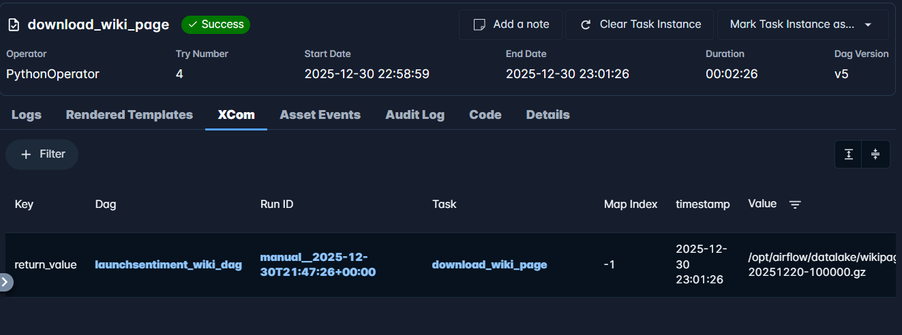
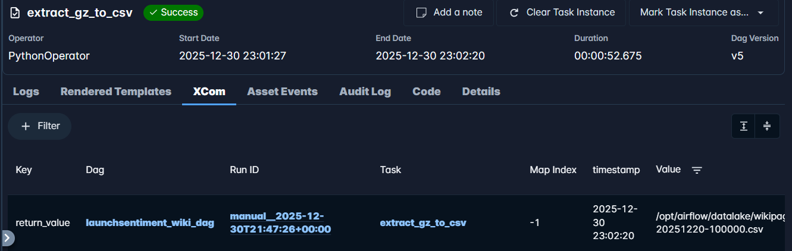
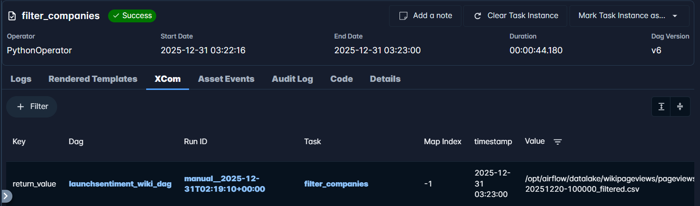
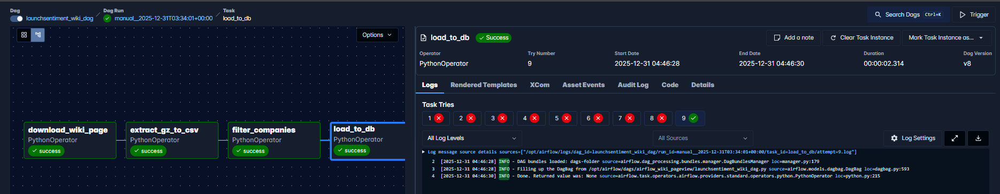
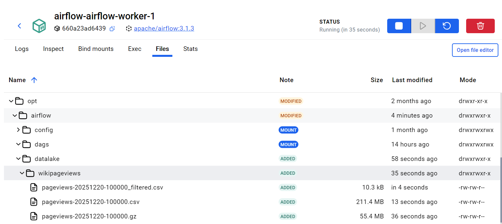

# LaunchSentiment – Wikipedia Pageviews Data Pipeline
## Project Overview

LaunchSentiment is a data pipeline built to support a stock market sentiment analysis use case by tracking Wikipedia pageviews for selected companies. The assumption is that changes in pageviews reflect public interest and sentiment, which can be correlated with stock price movements.

This pipeline ingests hourly Wikipedia pageviews data, filters specific company pages, and loads the results into a PostgreSQL database for analysis.

## Selected Companies

The pipeline currently tracks pageviews for the following companies:

- Apple (Apple_Inc.)

- Facebook

- Microsoft

- Google

- Amazon

## Architecture & Design

**Technology Stack**

- Orchestration: Apache Airflow

- Data Source: Wikimedia Pageviews Dumps

- Processing: Python

- Storage: PostgreSQL

- File Storage: Docker-mounted volume (/opt/airflow/datalake)

**The pipeline is orchestrated using an Apache Airflow DAG with the following tasks:**

    download_pageviews >> extract_gz_to_csv >> filter_companies >> load_to_postgres

Tasks are chained sequentially and communicate using XComs to pass file paths.

## Database Design & Idempotency
Data is loaded into a pre-created PostgreSQL table.

To ensure idempotency, a composite primary key was used when creating the table.
The key is a combination of:

    domain

    page_title

    view_count

This prevents duplicate records during retries or DAG re-runs.

**Insert Strategy**

    ON CONFLICT DO NOTHING

This ensures safe re-execution of the pipeline without duplicating data.

## Best Practices Implemented

**Retries:** Configured retries for transient failures on dag level.

**Failure Alerts:** Email notifications on task failure - **In progress**

**Idempotency:** Enforced via composite primary key

**Modular Design:** Each task has a single responsibility

**Container-Safe Paths:** Writes only to mounted volumes

**Re-runnable Pipeline:** Safe to re-run without data corruption

## Sample Analysis Query

The query below was run to identify the company with the highest pageviews for the interested hour:

    SELECT
        pagename,
        SUM(viewcount) AS total_views
    FROM wiki_pages
    GROUP BY pagename
    ORDER BY total_views DESC
    LIMIT 1;

## Conclusion       
Based on the analysis of Wikipedia pageviews for the selected hour (2025-12-20, 10:00), Google recorded the highest total pageviews among the five companies, with 1,939 views, representing approximately 41% of all tracked pageviews.

Under the assumption that changes in pageviews reflect public interest and sentiment, this indicates that Google had the highest public attention during this period, which may correlate with increased stock market interest or price movement for the company.

## Appendix

**Download task**

   

**Extract task**

   

**Filter task**

**Load Dataset to DB**
    

**Files location on container**

